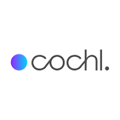

<!-- Profile: photo+icons left (centered in column), text right -->

  

    
    

      <a href="mailto:seunghyun.daniel.oh@gmail.com" title="이메일"><i class="fas fa-envelope"></i></a>
      <a href="https://github.com/ooshyun" title="깃허브"><i class="fab fa-github"></i></a>
      <a href="https://www.linkedin.com/in/seunghyun-oh-106815174/" title="링크드인"><i class="fab fa-linkedin"></i></a>
      <a href="" title="이력서"><i class="fas fa-file-pdf"></i></a>
    

  

  

    

      안녕하세요! 저는 <a href="https://www.cs.washington.edu/">워싱턴 대학교 Paul G. Allen School of Computer Science & Engineering</a>에서 <a href="https://homes.cs.washington.edu/~gshyam/">Shyamnath Gollakota</a> 교수님의 지도 아래 연구하고 있는 컴퓨터 과학 박사과정 학생입니다. 능동적 AI 에이전트(Proactive AI Agents)와 효율적 추론(Efficient Inference)을 연구하고 있습니다. 이전에는 증강 청각(Augmented Hearing)을 위한 웨어러블 AI 시스템을 개발했으며, 현재는 음성을 통해 상호작용하는 능동적 에이전트를 연구하고 있습니다.
        
      박사과정 이전에는 5년 이상 오디오 및 웨어러블 디바이스 분야에서 온디바이스 ML과 실시간 DSP를 개발했습니다: <a href="https://www.cochl.ai">Cochl</a>에서 여러 타깃 플랫폼(Syntiant, Arm Ethos, ESP32, Jetson, Edge TPU)을 위한 하드웨어 가속(TensorRT/QNN/SNPE) 기반 크로스 플랫폼 Sound AI SDK 개발, 프리랜서로 STM32 기반 스트리밍 음성 향상 시스템 설계, <a href="https://oliveunion.shop">Olive Union</a>에서 Tensilica DSP 코어 기반 보청기 DSP 알고리즘을 개발했습니다.
        
      여가 시간에는 트레일 러닝을 즐기고, 자서전과 철학 에세이를 읽는 것을 좋아합니다. 특히 월터 아이작슨, 알베르 카뮈, 프리드리히 니체의 작품을 좋아합니다.
        
      웹사이트 최종 업데이트 2026년 3월
    

  

### 학력
{:.logo}

  

    University of Washington
  

  

    컴퓨터 과학 및 공학 박사과정
  

  

    지도교수. <a href="https://homes.cs.washington.edu/~gshyam/">Shyamnath Gollakota</a>
  

  

    2025년 9월 - 현재
  

{:.logo}

  

    Coursera
  

  

    DeepLearning.AI TensorFlow Developer
  

  

    2021년 봄
  

{:.logo}

  

    한양대학교
  

  

    전자컴퓨터공학 석사
  

  

    지도교수. <a href="https://scholar.google.co.kr/citations?hl=en&user=N8CSltQAAAAJ">유창식</a>
  

  

    2020년 봄
  

{:.logo}

  

    인하대학교
  

  

    정보통신공학 학사
  

  

    지도교수. <a href="https://scholar.google.co.kr/citations?user=wcpWpdQAAAAJ&hl=ko">김기창</a>, <a href="https://scholar.google.com/citations?user=aDmqYYQAAAAJ&hl=en">변경수</a>
  

  

    2018년 봄
  

### 경력
{:.logo}

  

    <a href="https://www.cochl.ai">Cochl</a>
  

  

    SDK 백엔드 엔지니어 
  

  

    2023년 7월 - 2025년 8월 
  

{:.logo}

  

    <a href="https://ooshyun.github.io/">프리랜서</a>
  

  

    임베디드 AI 엔지니어 
  

  

    2023년 4월 - 2023년 7월 
  

{:.logo}

  

    <a href="https://oliveunion.shop">OliveUnion</a>
  

  

    임베디드 디지털 신호처리 엔지니어 
  

  

    2020년 4월 - 2023년 4월 
  

