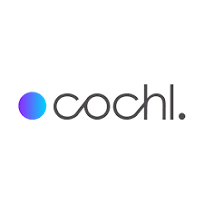

<!-- Profile: photo+icons left (centered in column), text right -->

  

    
    

      <a href="mailto:seunghyun.daniel.oh@gmail.com" title="Email"><i class="fas fa-envelope"></i></a>
      <a href="https://github.com/ooshyun" title="Github"><i class="fab fa-github"></i></a>
      <a href="https://www.linkedin.com/in/seunghyun-oh-106815174/" title="LinkedIn"><i class="fab fa-linkedin"></i></a>
      <a href="" title="CV"><i class="fas fa-file-pdf"></i></a>
    

  

  

    

      Hi! I'm a CS PhD student at the <a href="https://www.cs.washington.edu/">University of Washington Paul G. Allen School of Computer Science & Engineering</a>, advised by Prof. <a href="https://homes.cs.washington.edu/~gshyam/">Shyamnath Gollakota</a>. I research proactive AI agents and efficient inference. Previously I built wearable AI systems for augmented hearing; currently I work on proactive agents that interact through speech.
        
      Before the PhD, I spent 5+ years shipping on-device ML and real-time DSP in audio and wearable devices: cross-platform Sound AI SDK with hardware acceleration (TensorRT/QNN/SNPE/TPU) at <a href="https://www.cochl.ai">Cochl</a>, streaming speech enhancement on STM32 as a freelance engineer, and hearing aid DSP on Tensilica cores at <a href="https://us.oliveunion.com/">Olive Union</a>.
        
      In my free time, I love trail running and reading autobiographies and philosophical essays, especially Walter Isaacson, Albert Camus, and Friedrich Nietzsche.
        
      Website last updated 03/2026
    

  

### Education
{:.logo}

  

    University of Washington
  

  

    PhD in Computer Science & Engineering
  

  

    Advisor. <a href="https://homes.cs.washington.edu/~gshyam/">Shyamnath Gollakota</a>
  

  

    Sep 2025 - Current
  

{:.logo}

  

    Coursera
  

  

    DeepLearning.AI TensorFlow Developer
  

  

    Spring 2021
  

{:.logo}

  

    Hanyang University  
  

  

    Master in Electronics and Computer Engineering  
  

  

    Advisor. <a href="https://scholar.google.co.kr/citations?hl=en&user=OqA2u8UAAAAJ&view_op=list_works&sortby=pubdate">Changsik Yoo </a>
  

  

    Spring 2020  
  

 

{:.logo}

  

    Inha University
  

  

    B.A. in Information and Communication Engineering  
  
  
  

    Advisors. <a href="https://scholar.google.co.kr/citations?user=wcpWpdQAAAAJ&hl=ko">Kichang Kim</a> and <a href="https://scholar.google.com/citations?user=aDmqYYQAAAAJ&hl=en">Gyungsu Byun</a>  
  
  
  

    Spring 2018 
  

 

### Experience
{:.logo}

  

    <a href="https://www.cochl.ai">Cochl</a>
  

  

    Backend engineer for SDK    
  

  

    Jul 2023 - Aug 2025 
  

{:.logo}

  

    <a href="https://ooshyun.github.io/">Freelance</a>
  

  

    Embedded AI engineer    
  

  

    Apr 2023 - Jul 2023 
  

{:.logo}

  

    <a href="https://us.oliveunion.com/">OliveUnion</a>
  

  

    Embedded Digital signal processing engineer    
  

  

    Apr 2020 - Apr 2023 
  

