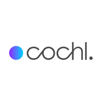

<!-- {:.profile} is adding configuration based on scss -->
{:.profile} 

### about

  Hi! I'm backend engineer developing Sound AI SDK for embedded devices in <a href="https://www.cochl.ai">Cochl(Seoul, Republic of Korea)</a>. Previously, I developed speech enhancement as a freelacne and true-wireless earbuds for hard-hearing people as a digital signal processing engineer in <a href="https://us.oliveunion.com/"> Olive Union(Seoul, Republic of Korea)</a>. As my Master's studies, I researched designing for analog circuits in the high-speed interface, such as PHY interface synchronizing blocks between CPU and DRAM. During this research, I was interested in human-centered signals, which led me to find a method to obtain and process this analog data.
      
  Pursuing my graduate studies in the field of designing analog circuits and interest in human-centered signals has led me to challenge in speech. As an individual with 3+ years of engineering industry experience as an Embedded DSP Engineer, I designed DSP algorithms to implement those in devices using optimization, acceleration, and noise reduction techniques. With this, I was challenged to broaden the ability of tiny devices to process human-centered signals using ML techniques. Specifically, my research has concentrated on optimizing high computing algorithms into embedded system especially in sound domain. With my background in understanding hardware and signal processing, I want to contribute to allowing these tiny devices to go beyond their constraints to process signals with machine learning techniques.
    
  In my free time, I love trail running and reading autobiographies and philosophical essays, especially Walter Isaacson, Albert Camus, and Friedrich Nietzsche.
    
  (Website last updated 12/2023)
    
  

    <a href="mailto:seunghyun.daniel.oh@gmail.com"> Email</a> • <a href="https://github.com/ooshyun"> Github</a> • <a href="https://ooshyun.notion.site/Seunghyun-Oh-3891a8e850834a8480cf3797cb49916e"> Notion</a> • <a href="" Hello> CV </a>
    
         
  

---

### Education
{:.logo}

  

    Coursera
  

  

    DeepLearning.AI TensorFlow Developer
  

  

    Spring 2021
  

 

{:.logo}

  

    Hanyang University  
  

  

    Master in Electronics and Computer Engineering  
  

  

    Advisor. <a href="https://scholar.google.co.kr/citations?hl=en&user=OqA2u8UAAAAJ&view_op=list_works&sortby=pubdate">Changsik Yoo </a>
  

  

    Spring 2020  
  

 

{:.logo}

  

    Inha University
  

  

    B.A. in Information and Communication Engineering  
  
  
  

    Advisors. <a href="https://scholar.google.co.kr/citations?user=wcpWpdQAAAAJ&hl=ko">Kichang Kim</a> and <a href="http://icslab.cafe24.com/">Gyungsu Byun</a>  
  
  
  

    Spring 2018 
  

 

### Experience
{:.logo}

  

    <a href="https://www.cochl.ai">Cochl</a>
  

  

    Backend engineer for SDK    
  

  

    Jul 2023 - Current 
  

{:.logo}

  

    <a href="https://ooshyun.github.io/">Freelance</a>
  

  

    Embedded AI engineer    
  

  

    Apr 2023 - Jul 2023 
  

{:.logo}

  

    <a href="https://us.oliveunion.com/">OliveUnion</a>
  

  

    Embedded Digital signal processing engineer    
  

  

    Apr 2020 - Apr 2023 
  

